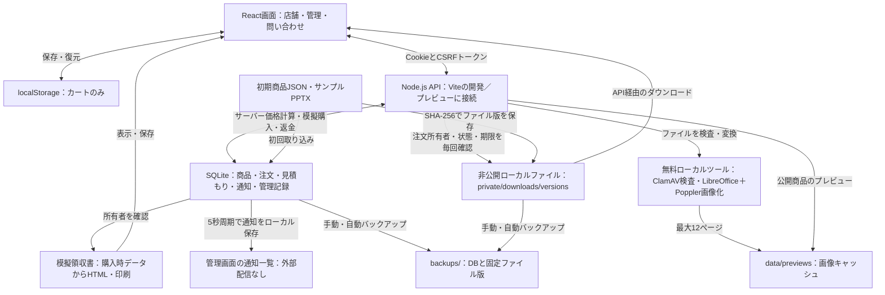

# Slide Market

PowerPoint資料のダウンロード販売を体験する学習用デモ。React / TypeScript / Viteで実装しています。実際の販売・請求は行いません。

## 現在の実装：サービス登録不要のローカル運用

Node.js・SQLite・ローカルファイルだけで、購入と運営の処理を確認できます。外部アカウント・有料サービスは使わず、実際の請求・返金・メール送信は行いません。

### 起動と管理画面

Node.js 24を使用してください。

```sh
npm ci --cache /tmp/slide-market-npm-cache
npm run dev
```

- 店舗：`http://localhost:5173/`、管理画面：`http://localhost:5173/#admin`。
- 初回起動で `data/admin-password.txt`（運営管理者）と `data/editor-password.txt`（商品管理者）を生成します。ローカルで該当ファイルを開き、ログイン画面へ入力してください。
- 運営管理者は全機能、商品管理者は商品の編集・ファイル登録と自身の認証設定を操作できます。管理ログインは1時間、購入者用のブラウザセッションは30日で失効します。
- パスワードが不明な場合はサーバー停止後に `npm run admin:reset` で再発行します。既存管理セッションの権限とMFA設定も解除します。
- `npm run build` → `npm run preview` でも画面とAPIを起動できます。静的ホスティングだけではAPIは動きません。

### 実装済みの機能

| 機能 | 現在の動作 |
| --- | --- |
| 商品管理 | 商品の新規登録・編集・下書き・公開・販売停止、更新競合の検出、セット商品登録 |
| PPTX管理 | 50MB以下のPPTXを構造検査。ClamAV接続・検査必須モード。問題検出した版の公開・購入・取得を停止 |
| 商品情報 | サイズ・ページ数・対応ソフト。LibreOffice＋Popplerで最大12ページの画像生成。未導入・失敗時は文字抜粋 |
| 購入確認 | サーバーで計算する10分有効の見積もり、価格・商品変更時の再確認、規約同意とバージョンの記録 |
| 注文 | 模擬決済、操作キーの重複防止、購入済み資料の再購入防止・再取得案内、購入時の商品・ファイル版・規約本文の保存 |
| ダウンロード | Cookieのブラウザセッションと購入権限を確認。5分有効・同じブラウザ専用のリンクを発行 |
| 模擬領収書 | 購入時の商品・セット価格・割引・合計・仮の10%税額を保存し、HTML表示・保存・印刷。返金状態も表示 |
| 注文管理・返金 | 注文番号・商品名・状態で検索。理由付き全額模擬返金で権限と発行済みリンクを停止 |
| 問い合わせ | フォームからSQLiteに保存し、管理画面で未対応・対応中・完了を更新 |
| 通知 | 購入・返金・問い合わせの通知内容をローカル保存。外部配信なし。5秒周期、失敗時の再試行と手動再処理 |
| 利便性 | 価格・新着順、ブラウザ単位のお気に入り、期限・回数上限付きクーポン、セット販売 |
| 販売条件 | 利用規約・利用許諾、プライバシー、返金条件、特商法表記の準備用ページ |
| セキュリティ | Cookie・CSRF・役割・回数制限、任意のTOTP MFAと復旧コード、返金時の5分有効の再認証、操作履歴 |
| 運用・分析 | DB・通知の状況表示、日別の購入経路イベント集計、手動／自動バックアップ・保持件数・整合性検査・復元 |
| SEO | 商品別URL `/products/商品ID`。ビルドで商品ごとのメタ情報・構造化データ・サイトマップを生成 |

購入確認で規約と返金条件へ同意してから模擬決済を確定します。管理画面のクーポンは大文字コードで登録します。セットと単品で同じ資料が重複する注文は拒否します。クーポンの利用回数は返金後も戻しません。

通知の状態は `pending`（予定）→ `saved`（ローカル保存完了）。失敗は指数バックオフで最大8回再試行し、`failed` にします。管理画面から失敗の模擬と再処理を実行できます。送信先アドレスの認証や外部メール配信はありません。

### 管理者の認証設定

管理画面の「認証設定」から、運営管理者・商品管理者それぞれに任意のTOTP MFAを設定できます。パスワードで開始し、オフライン対応の認証アプリへ秘密情報を登録して6桁コードで確定します。復旧コード8個は一度だけ表示され、各1回だけ使用できます。使用済みTOTPコードの再利用も拒否します。

ローカル確認用に `npm run admin:otp`（商品管理者は `npm run admin:otp -- editor`）でコードを生成できます。ただしDBと同じ端末で生成する方法は、独立した第二要素にはなりません。秘密情報・復旧コードはGitへ保存しないでください。紛失時はサーバー停止後の `npm run admin:reset` でパスワードとMFAを再設定します。

模擬返金前にパスワードを再入力します。MFA設定済みなら未使用のコードまたは復旧コードも必要です。APIの再認証は5分有効です。

### 画像プレビュー・ファイル検査・模擬領収書

無料のLibreOffice Impress・Poppler・ClamAVを導入すると、管理画面で「画像プレビュー生成・ウイルス検査」を実行できます。新しいPPTXの登録でも同じ処理を行います。画像変換は未導入・失敗時に文字抜粋へ戻します。ClamAVは未導入を未検査と記録し、定義不足・検査失敗・問題検出では登録を拒否します。`SHOP_SCAN_MODE=required` で未検査商品の公開・新規購入も拒否します。

```sh
npm run tools:check
# まとめて準備する場合はサーバー停止後
npm run assets:prepare
```

新しい注文の詳細・履歴から模擬領収書を表示・HTML保存・印刷できます。割引後の模擬合計を仮の税込10%として税額を切り捨て計算します。実入金の証明や適格請求書には使えません。

ツール導入・環境変数・検査状態・税額の仮定は [ローカル運用手順](docs/local-operations.md) を参照してください。公式ウイルス定義の取得・更新には通信環境が必要ですが、アカウント登録は不要です。アプリから自動取得は行いません。

### 保存先とファイルの更新

- `data/shop.sqlite`：商品・見積もり・注文・問い合わせ・通知・お気に入り・監査履歴。
- `private/downloads/`：初期サンプル。`npm run generate` で初期商品JSONから再生成します。
- `private/downloads/versions/`：購入時ファイルをSHA-256で識別して保存。DBと一緒にバックアップしてください。
- 商品JSONは初期データの取り込みに使用します。初回起動後の商品変更は管理画面で行い、PPTXはアップロードして更新します。
- カートのみlocalStorageへ保存します。過去のlocalStorageのデモ注文から購入権限は発行しません。
- リセットはこのブラウザの注文と取得権限を削除します。通知・問い合わせ・監査履歴は運営記録として残ります。
- `data/`、`backups/`、生成済みファイル版はGit管理とViteの直接配信から除外しています。パスワードやDBを共有しないでください。

### バックアップと復元

```sh
npm run backup
npm run backup:list
npm run backup:check -- backup-実際に作成された名前
npm run restore:drill -- backup-実際に作成された名前
# 開発・プレビューサーバーを停止してから実行
npm run restore -- backup-実際に作成された名前
```

`backups/` にSQLiteの整合したスナップショット、購入時のファイル、チェックサム一覧を保存します。復元前にチェックサム・SQLite・外部キー・購入済みファイルを検証し、現在のデータも退避します。起動中のサーバーへの復元は拒否します。復元後は管理パスワードがバックアップ時点に戻るため、必要なら `npm run admin:reset` を実行してください。バックアップにも問い合わせ等が含まれるため、安全に保管してください。

サーバー稼働中は起動後の最初の確認時と以後24時間ごとに自動バックアップを作り、直近7件を保持します。5秒周期で実行時刻を確認します。停止中は実行しません。`SHOP_BACKUP_INTERVAL_MS`（既定86400000、0で無効）と `SHOP_BACKUP_KEEP`（既定7、1〜365）で変更できます。自動分だけを削除し、手動バックアップは残します。失敗時は再試行し、管理画面の「運用・分析」で状態を確認できます。DBのMFA秘密情報もバックアップに含まれます。同じディスクのバックアップはディスク故障対策にはならないため、別媒体への保管は運営者が行います。

検証・一時領域への復元演習は稼働中にも実行でき、普段のDBを変更しません。画像キャッシュはバックアップ対象外で、復元後に再生成できます。具体的な復元・確認・戻し方は [ローカル運用手順](docs/local-operations.md) に記載しています。

### 検証

```sh
npm run build
npm run test:server
CHROMIUM_PATH=/usr/bin/chromium npm test
```

ブラウザテストは専用の一時DBとテスト用管理資格情報を使用し、普段のDBを変更しません。開発サーバーを停止してから実行してください。サーバーテストは期限切れ・再起動・通知再試行・バックアップ復元を確認します。

### 既知の制約と本番向けに残る事項

現状はローカル検証用です。購入者はCookieで識別し、メール本人確認・端末間の履歴共有はありません。模擬決済を誰でも成功させられるため、実入金の証明には使えません。実決済・Webhook・メール配信・本番ストレージ・外部障害通知は未実装です。ClamAVの定義準備・更新と変換プロセスのOS隔離は別途必要です。販売者情報、実販売の税区分・領収書、返金条件、個人情報の保存期間も販売開始前に確定します。

検索エンジンへの登録は既定で禁止しています。商品メタ情報はビルド時点のDBを参照するため、商品変更後は再ビルドが必要です。外部サービスへ送らないイベント件数の集計は、ユニーク人数・厳密な転換率を示すものではありません。

## ディレクトリ構成

```text
ec_site_sample/
├── src/
│   ├── main.tsx                 # 店舗画面・購入確認・履歴
│   ├── LocalPages.tsx           # 管理・問い合わせ・販売条件の画面
│   ├── AdminSecurity.tsx        # MFA設定・解除・復旧コード
│   ├── api.ts                   # API接続・型・CSRFトークン管理
│   ├── products.json            # 初期6商品の取り込み用データ
│   └── style.css                # 店舗・管理画面・レスポンシブ対応
├── server/
│   ├── shop.mjs                 # API・価格計算・模擬決済・管理・通知
│   ├── security.mjs             # TOTP・復旧コード
│   ├── legal.mjs                # 販売条件本文・購入時スナップショット
│   ├── pagination.mjs           # カーソルページング
│   ├── assets.mjs               # ClamAV検査・PPTX→PDF→PNG変換
│   ├── receipts.mjs             # 模擬領収書の購入時保存・印刷用HTML
│   ├── backups.mjs              # バックアップ・自動分の保持
│   └── storage.mjs              # SQLite・初期取り込み・PPTX検証
├── private/downloads/
│   ├── *.pptx                   # 初期6商品のサンプル
│   └── versions/                # SHA-256で固定するファイル版（生成・Git除外）
├── public/previews/             # 初期サンプルの表紙SVG（生成処理の出力）
├── data/                        # SQLite・管理パスワード・起動PID（生成・Git除外）
├── backups/                     # DB・ファイル版・チェックサム（生成・Git除外）
├── scripts/
│   ├── generate-slides.mjs      # 初期PPTXと表紙SVGの生成
│   ├── generate-seo.mjs         # ビルド時の商品HTML・メタ情報・サイトマップ
│   ├── prepare-assets.mjs       # 無料ツール確認・既存版の画像生成と検査
│   └── local-data.mjs           # バックアップ・検証・復元演習・管理パスワード再発行
├── tests/
│   ├── shop.spec.ts             # 店舗のブラウザテスト
│   ├── api.spec.ts              # 権限・見積もり・管理・返金などのAPIテスト
│   ├── local.spec.ts            # 管理画面・問い合わせ・お気に入りなど
│   ├── assets.test.mjs          # 変換・検査失敗・領収書計算
│   ├── tools.test.mjs           # 無料ツールの実変換・検査（任意実行）
│   └── server.test.mjs          # 期限・再起動・通知再試行・復元
├── docs/                        # 基本設計・要件・設計パターン・初期履歴
├── dist/                        # ビルド成果物（生成・Git除外）
├── vite.config.mjs              # 開発／プレビューのAPI接続・非公開ファイル保護
├── playwright.config.ts         # PC／モバイル・一時DB・テスト資格情報
├── index.html
├── package.json
├── package-lock.json
├── tsconfig.json
├── .gitignore
└── README.md
```

## アプリの仕組み



商品詳細は `/products/商品ID`、他の画面は `#cart`、`#checkout`、`#order/注文ID`、`#history`、`#guide`、`#contact`、`#legal/種類`、`#admin` で切り替えます。旧形式 `#product/商品ID` も表示できます。

APIから公開商品の情報を取得し、購入確認で10分有効の見積もりを作ります。同意後の模擬購入では、単価・公開状態・商品版・クーポンをサーバーで再検証して注文と通知を同じトランザクションで保存します。成功時はカートを空にし、失敗時はカートを残します。表示価格は架空の円・税込価格で、実販売の税計算や正式な領収書発行はありません。新しい注文には仮の10%税込モデルの模擬領収書を作成します。

ダウンロードは `POST /api/orders/注文ID/download-links/商品ID` でリンクを作り、`GET /api/downloads/トークン` で取得します。トークンはDBにハッシュで保存し、同じブラウザのCookie・注文状態・5分の期限を取得時にも確認します。これはストレージの署名付きURLではなく、ローカルAPIのトークン方式です。返金・リセット後は発行済みリンクも使用できません。取得済みファイルは回収できません。

注文履歴・管理注文・操作履歴はカーソルで続きを表示します（APIは既定20件、最大100件／ページ）。古い注文も個別に取得できます。DBから古い注文を自動削除しません。購入済み判定は表示中の履歴件数に依存せず、返金・リセット後は再購入できます。購入時に同意した規約・返金条件の本文は注文に保存し、注文詳細で確認できます。

APIのエラーはcode・message・requestIdを返します。画面のエラーに表示する確認番号と、管理画面のエラー記録を照合できます。初期SQLite版の既存デモ注文はファイル版を固定し、既存ブラウザCookieを引き継ぎます。localStorageだけに保存されていた初期静的デモ注文は移行しません。

## 確認済みの検証結果

2026年10月1日の実装確認で、型チェック・ビルド、PC／モバイルのAPI・画面テスト計14件、期限・再起動・MFA・返金再認証・購入済み判定・ページング・自動バックアップと復元のサーバー・ファイル処理テスト10件が成功しています。実ツール確認2件では初期6商品の各4ページのPNG変換と、ClamAVのローカル検証用定義による検出・定義不正時の拒否を確認しました。公式ウイルス定義の取得・更新はこの環境では未確認です。ビルド後のプレビューでも商品メタ情報と管理画面・APIの接続を確認しました。実決済・メール認証・外部配信・本番性能の検証結果ではありません。

## 設計資料

| 資料 | 内容 |
| --- | --- |
| [ローカル運用手順](docs/local-operations.md) | 無料ツールの導入、画像生成・検査、模擬領収書、バックアップ確認・復元演習 |
| [ローカル基本設計](docs/local-basic-design.md) | 現在の画面・API・SQLite・状態・権限・運用仕様 |
| [基本設計書（HTML）](docs/production-basic-design.html) | 現在の実装状況・ローカル構成図と、実販売に向けた将来設計。ブラウザ閲覧・印刷・PDF保存対応 |
| [要件・初期設計](docs/demo-requirements.md) | 現在の要件と実装状況、初期版の設計履歴 |
| [ECサイトの設計パターン](docs/ec-site-patterns.md) | 一般的な選択肢と、このプロジェクトで採用した方式 |
| [初期の静的デモの説明](docs/static-demo-history.md) | 過去のREADMEの説明・構成図を保存した履歴 |

初期サンプルは表紙と3枚の内容ページを含む自作資料です。学習・編集・商用利用を許可します。元ファイルの再販売・再配布は禁止します。
