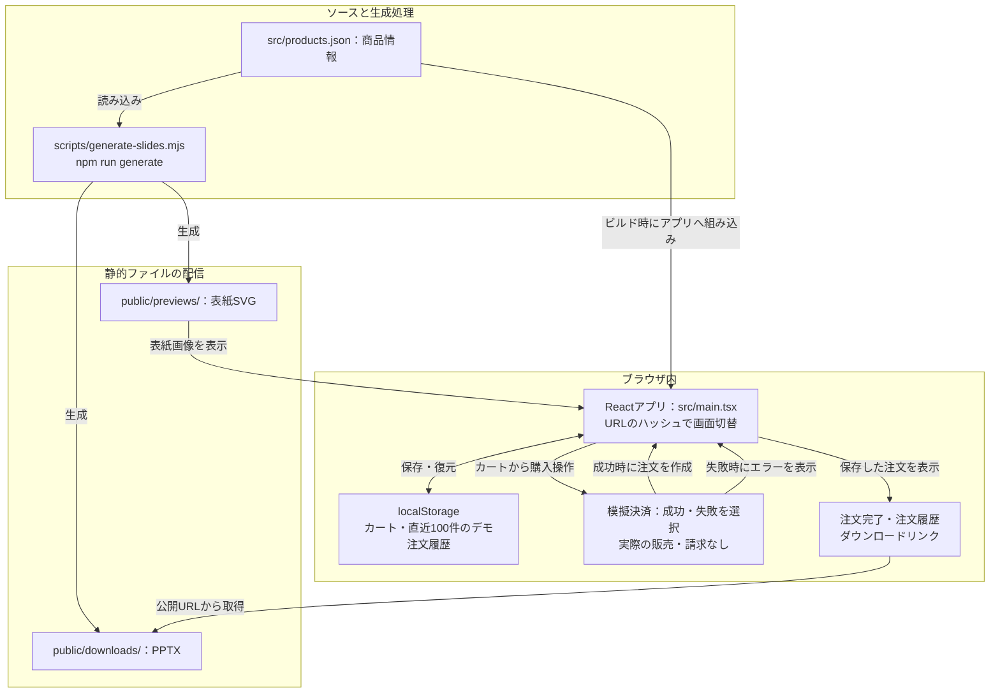

# Slide Market

PowerPoint資料のダウンロード販売を体験する学習用デモ。React / TypeScript / Viteで実装しています。実際の販売・請求は行いません。

## 起動

Node.js 22.12以上（この環境では24を使用）で実行します。

```sh
npm ci --cache /tmp/slide-market-npm-cache
npm run dev
```

開発サーバーの既定ポートは5173です。

## 機能

- 6商品の一覧、検索、カテゴリ絞り込み、詳細・表紙プレビュー
- 重複しないカート、合計、削除、ブラウザへの保存
- 成功・失敗を切り替えられる模擬決済
- 注文完了、PPTXダウンロード、直近100件のデモ注文履歴
- ご利用ガイド、保存データのリセット、モバイル対応

商品情報は `src/products.json` で更新します。ファイルと表紙は次のコマンドで再生成します。

```sh
npm run generate
```

各商品は表紙と3枚の内容ページを含む自作サンプルです。編集・学習・商用利用を許可します。元ファイルの再販売・再配布は禁止します。

## ディレクトリ構成

```text
ec_site_sample/
├── src/
│   ├── main.tsx             # 画面・カート・模擬決済・注文履歴
│   ├── products.json        # 6商品の情報
│   └── style.css            # デザイン・レスポンシブ対応
├── public/
│   ├── downloads/           # 各商品4ページのサンプルPPTX
│   └── previews/            # 商品の表紙SVG画像
├── scripts/
│   └── generate-slides.mjs  # PPTXと表紙画像の生成
├── tests/
│   └── shop.spec.ts          # ブラウザでの動作テスト
├── docs/
│   ├── ec-site-patterns.md  # ECサイトの設計パターン整理
│   └── demo-requirements.md # 要件・初期設計
├── index.html              # アプリを読み込むHTML
├── package.json            # 依存パッケージと実行コマンド
├── package-lock.json       # 依存パッケージのバージョン固定
├── playwright.config.ts    # PC・モバイルのブラウザテスト設定
├── tsconfig.json           # TypeScriptの設定
├── .gitignore              # Git管理から除外するファイル
└── README.md
```

## アプリの仕組み

### 構成図



バックエンドやデータベースはありません。PPTXの公開URLは購入操作なしでも利用でき、図のダウンロードリンクには購入権限を検証する処理はありません。

### 画面と商品情報

バックエンドやデータベースを使わず、Reactでブラウザ内の画面と状態を管理します。`src/main.tsx` がURLのハッシュ（`#` 以降）を読み取り、`#home` は商品一覧、`#product/proposal` は商品詳細、`#cart` はカート、`#checkout` は模擬決済、`#order/注文ID` は注文完了、`#history` は注文履歴、`#guide` はご利用ガイドを表示します。

商品情報は `src/products.json` から読み込みます。商品名、価格、カテゴリ、説明、スライドの内容などを変更する場合は、このファイルを更新します。

### カート・模擬決済・注文履歴

カートには商品IDを重複しないように保存し、商品情報から合計金額を計算します。模擬決済では「成功」「失敗を試す」を選べます。成功するとデモ注文を作成してカートを空にし、注文完了画面へ移動します。失敗するとエラーを表示し、カートを残して再試行できます。実際の決済サービスには接続せず、カード情報や個人情報の入力はありません。

カートと直近100件のデモ注文履歴は、ブラウザの `localStorage` にキー `slide-market-demo-v1` で保存します。同じブラウザ・同じオリジンで再読み込みしても保持されますが、別の端末には引き継がれません。ご利用ガイドのリセット操作で、保存したカートと注文履歴を空にできます。

### ファイルの生成とダウンロード

PPTXは `public/downloads/`、表紙のSVG画像は `public/previews/` に置き、静的ファイルとして配布します。注文完了画面と注文履歴のダウンロードリンクは、`/downloads/商品ID.pptx` を参照します。ファイルは購入操作なしでもURLから取得でき、本番販売用のアクセス制御はありません。

商品情報を更新した後、リポジトリのルートで `npm run generate` を実行すると、`scripts/generate-slides.mjs` が商品情報を読み取り、PPTXとプレビュー画像を再生成します。各PPTXは表紙と3枚の内容ページで構成されます。

## 検証

```sh
npm run build
PLAYWRIGHT_BROWSERS_PATH=/tmp/slide-market-browsers npx playwright install chromium
PLAYWRIGHT_BROWSERS_PATH=/tmp/slide-market-browsers npm test
```

このクラウド環境では既存のChromiumを使い、`CHROMIUM_PATH=/usr/bin/chromium npm test` でも実行できます。

ブラウザテストはデスクトップとモバイルの画面幅で、検索、購入、失敗時の再試行、ダウンロード、保存、削除、リセットなどを確認します。Linux環境によってはPlaywrightのOS依存ライブラリが別途必要です。

## 制約

決済はブラウザ内のシミュレーションです。個人情報・カード情報は入力しません。注文・カートはローカルストレージに保存され、購入証明には使えません。PPTXファイルは公開パスにあるため、購入操作なしでも取得できます。本番販売にはサーバーでの価格計算、決済連携、Webhook検証、注文管理、非公開ファイルのアクセス制御が必要です。

設計資料：`docs/ec-site-patterns.md`、`docs/demo-requirements.md`。

実運用に向けた基本設計書：[production-basic-design.html](docs/production-basic-design.html)。HTMLファイルをブラウザで開くと、構成図、機能・画面・データ・API設計、運用・テスト方針を確認できます。印刷・PDF保存にも対応しています。
