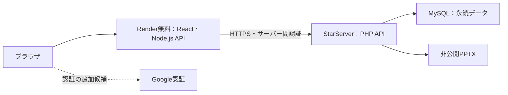

# 無料ホスティング構成の検討メモ

記録日：2026年10月3日（日本時間）。この文書は会話で合意・検討した方針を保存したものです。以下の構成は未実装で、現在のローカル実装を説明するものではありません。

追記：その後の実装依頼により、Google認証とPHP・MySQL保存、メモリセッションを追加しました。この文書の未実装・未確定という記述は議論を保存した時点の状態です。最新の設定・実装仕様は [配備手順](render-starserver.md) を参照してください。

## 目的と採用方針

Renderの無料Webサービスを画面・Node.js APIの実行先とし、StarServerをMySQLと販売PPTXの永続保存先にする。無料運用を優先し、Renderの休止、起動時の約1分の待ち時間、利用上限による停止を許容する。

StarServerのMySQLには、同サーバーに配置したPHPからアクセスできることをユーザーが確認している。RenderからMySQLへ直接接続することは前提にせず、HTTPSでPHP APIを呼び出す構成とする。

## データとセッション

| 保存先 | 管理対象・方針 |
| --- | --- |
| Renderのメモリ | 購入者・管理者のセッション。一時的な見積もりとダウンロードトークンもここで管理する案 |
| StarServerのMySQL | 商品、確定注文、決済状態、購入権限、管理者の認証設定。Google認証を採用する場合はユーザーと注文の紐付けも保存 |
| StarServerのファイル領域 | 販売PPTX。公開URLから無条件で取得できない保存・配信方式を設ける |

ユーザーはセッションの永続保存を不要とし、Renderが起動している間に取引が成立する前提を了承した。休止・再起動でセッションは失効し、再ログインする。未完了の購入手続きは再開ではなくやり直す。確定済み注文と購入権限はMySQLに残す。

この前提でも、実決済を導入する際には決済直後の停止や通知の再送に備え、注文ID・重複防止キー・決済状態をMySQLに保存する。決済通知の処理はブラウザセッションに依存させない。

## Google認証についての検討

Google認証を追加すれば、セッション消失後や別端末でも再ログインし、同じ購入履歴・購入権限を取得できる。

- サーバーでGoogleの認証結果を検証し、固定のユーザー識別子（`sub`）をユーザーに紐付ける。メールアドレスのみを識別キーにしない。
- Googleユーザーと注文・購入権限の対応をMySQLに永続保存する。
- Render上のログインセッションはメモリ管理のままとする。
- Googleのパスワードはアプリで収集しない。

Google認証は解決策として議論した段階で、実装指示・正式採用はまだ確定していない。既存のブラウザ単位の注文をGoogleユーザーへ移行する方法も未決定。

## 規約・無料プランの確認結果

### Render

ユーザーが提示した利用規約は2026年7月10日改定。本文にはEC・商用利用を一律に禁止する記載はなく、第13条は商用利用を想定している。ただし、規約に組み込まれたAcceptable Use Policyの本文は未確認で、全面的な利用許可を断定したものではない。

第2条はSensitive Dataの送信・アップロード・保存を禁止し、カード保有者情報や銀行口座番号などを対象に含める。実決済を追加する場合は、決済会社がホストする画面などでカード情報を扱い、RenderのAPI・ログを通さない設計とする。第4条のStripe利用・返金不可はRenderの利用料金に関する規定で、このECの決済・返金条件ではない。

ユーザーが提示した無料インスタンスの公式説明には **“Do not use them for production applications.”** と明記されている。無料構成の採用は本番利用が承認されたことを意味しない。実販売への移行時にこの条件とAcceptable Use Policyを確認する。

提示資料で確認した制約：

- 15分間受信トラフィックがないと休止し、再開には約1分かかる。
- 休止・再起動・再デプロイでローカルファイルへの変更が失われる。無料Webサービスに永続ディスクは付けられない。
- 無料インスタンス時間はワークスペース全体で月750時間。超過すると月末まで無料Webサービスが停止する。
- 帯域・ビルドの含有量を超えた場合、支払方法や支出上限の状況に応じて追加課金、サービス停止、または新規ビルド停止となる。
- 外部DB・API・オブジェクトストレージへの通信が異常に多い場合、無料Webサービスが停止される可能性がある。
- 無料Postgresは作成後30日で失効し、無料Key Valueは再起動でデータを失う。本案の保存先には使わない。
- ワークスペースのプラン変更だけでは無料インスタンスの制限は解除されない。

### StarServer

ユーザーは商用利用の制限がなさそうであると判断しているが、正式なプラン名・利用規約・無料プラン仕様は未確認。MySQLへ同サーバー上のPHPからアクセスできること以外は、実環境で検証していない。

## 現在の実装との差分と今後の作業

現在はReact / TypeScript / Vite、Node.js API、SQLite、非公開ローカルPPTXで動作する。決済・返金・領収書は模擬処理で、実請求は行わない。

新構成には次の作業が必要：

1. StarServerの正式なプラン、HTTPS、PHPバージョン、保存容量・転送量、非公開ファイル保存、通信・実行制限を確認する。
2. PHP APIの認証・権限制御とRenderからの接続を設計・検証する。サーバー間認証情報はブラウザへ渡さない。
3. SQLiteからMySQLへスキーマとデータアクセスを移行する。注文確定・クーポン消費・購入権限付与は同一トランザクションで保存する。
4. DBに依存した現行セッション管理を、Renderのメモリ管理へ変更する。Cookie・CSRF対策は維持する。
5. PPTXの保存・配信を変更し、購入権限を確認した上で配信する。休止・再起動時に残る一時データも整理する。
6. Google認証の採用を確定し、採用する場合はユーザー・注文紐付け、再ログイン、既存注文の移行方法を設計する。
7. LibreOffice・Poppler・ClamAVの実行可否を確認する。無料環境で実行困難な場合は、ローカルで処理したファイルを登録する方式を検討する。
8. バックアップ方式をDB・ファイルの外部保存に合わせて変更し、復元を確認する。
9. 実販売へ進む場合は、ホスティングの本番利用条件、実決済・Webhook・重複防止・返金処理、販売者表示と税・個人情報の取り扱いを整備する。

このメモの保存時点ではコード変更・サービス設定・デプロイ・実決済導入は行っていない。
