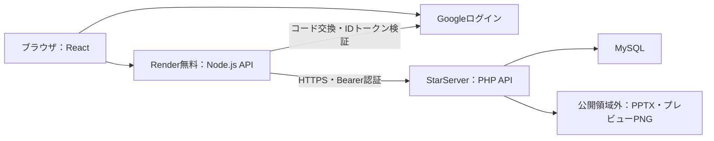

# Render無料＋StarServer PHP・MySQLの配備手順

更新日：2026年10月3日。Google認証、メモリセッション、PHP経由のMySQL・非公開ファイル保存に対応した検証用構成です。決済は引き続き模擬処理です。

## 構成と保存先



Renderのメモリにはブラウザセッション、CSRFトークン、Google認証中のstate・nonce・PKCE、見積もり、MFA設定中の情報、返金再認証、ダウンロードリンクを保存します。再起動・休止で失効し、Googleで再ログインして購入履歴を取得します。進行中の購入手続きはやり直します。管理者も再ログインが必要です。

商品、Googleユーザー識別子・表示名、注文、購入権限、購入時規約・模擬領収書、管理者の認証設定、クーポン、お気に入り、問い合わせ、通知、監査・エラー記録、集計はMySQLに保存します。`sessions`テーブルは既存スキーマに合わせた名前で、Googleユーザー等の購入情報の所有者IDを保存します。ブラウザのCookieや認証セッションを保存するテーブルではありません。

Googleユーザーは検証済み`sub`から作る固定IDで識別します。Googleログインは購入者向けで、管理者・商品管理者のパスワード・MFA・権限制御は独立しています。Google認証を有効にした場合は、購入とお気に入り更新にログインが必要です。Googleのパスワード、アクセストークン、リフレッシュトークンはDBに保存しません。

## 1. StarServerを準備する

必要条件：PHP 7.4以降（検証はPHP 8.3）、PDO MySQL、MySQL 5.7以降またはJSON関数対応MariaDB、InnoDB、HTTPS、公開領域外へのファイル保存権限。利用プランの商用利用条件、PHPの実行時間・メモリ・受信サイズ、容量・転送量は契約先で確認してください。

1. 専用MySQLデータベース・ユーザーを作成する。既存の別アプリのDBは使わない。
2. DB管理画面から [schema.sql](../starserver/schema.sql) を読み込む。
3. 公開領域の `public_html/slide-market/` に `starserver/index.php` と `.htaccess` だけを配置する。
4. 公開領域と同階層に `slide-market-private/` を作る。`config.example.php` をここへ `config.php` として配置し、DB接続設定・APIキー・保存先を記入する。例：`/home/user/public_html/slide-market/index.php` に対し `/home/user/slide-market-private/config.php`。異なる構成なら `index.php` の `$configPath` を変更する。
5. `slide-market-private/files/` を作り、PHP実行ユーザーだけが読み書きできるようにする。APIは保存先が公開ドキュメントルート内の場合、処理を拒否する。PHPの`open_basedir`により公開領域外へアクセスできないプランでは、この方式は使えないため契約設定・保存方式の調整が必要。
6. APIキーを生成する。`node -e "console.log(require('node:crypto').randomBytes(32).toString('hex'))"` の出力をPHP設定とRenderの環境変数に同じ値で設定する。GitやURL、ブラウザへ渡さない。
7. HTTPSのAPI URLを確認する。例：`https://YOUR_HOST/slide-market/index.php`。`Authorization`ヘッダーがPHPへ届く必要がある。`.htaccess`に転送設定を含めている。

PHP APIはRenderの信頼済みコード向けの内部DBアダプターです。ブラウザから直接呼び出さず、CORSを許可しません。ユーザーからSQLを受け取る公開APIではありません。専用DB以外への権限をDBユーザーに与えないでください。

## 2. Google認証を設定する

Google CloudでOAuthクライアント（ウェブアプリケーション）を作成し、同意画面・テストユーザー／公開状態を設定します。スコープは `openid profile` です。

- リダイレクトURI：`https://YOUR_RENDER_HOST/api/auth/google/callback`
- ローカル確認用：`http://localhost:5173/api/auth/google/callback`
- アプリの `SITE_URL` とGoogle側のURIを正確に一致させる。
- クライアントID・シークレットはRenderの環境変数へ設定する。`VITE_`付きの変数には保存しない。

stateによるログインCSRF対策、nonce、PKCE、Google公開鍵によるRS256署名、発行元・audience・期限・`sub`の検証を実装しています。Googleから戻るリクエストを受けられるようCookieはSameSite=Laxとし、HTTPSではSecureを付けます。通常の更新APIにはCSRFトークンと同一オリジン検査を必要とします。ログイン・ログアウト時にCookieとCSRFを更新します。

## 3. 初期商品または既存ローカルデータを登録する

ローカルのNode.js 24環境で依存関係をインストールし、[.env.example](../.env.example) を参考にGit対象外の `.env` を作ります。

```dotenv
STARSERVER_API_URL=https://YOUR_HOST/slide-market/index.php
STARSERVER_API_KEY=PHP設定と同じ秘密キー
LOCAL_ADMIN_PASSWORD=初期運営管理者の強いパスワード
LOCAL_EDITOR_PASSWORD=初期商品管理者の別の強いパスワード
```

```sh
npm ci
# ローカルサーバーを停止してから実行
npm run storage:import
```

ローカルDBがない場合は初期6商品と指定した管理パスワードから生成します。既存DBがある場合は商品・注文・認証設定等を引き継ぎます。ファイルをチェックサム検証して先に保存し、DB登録を一括トランザクションで行います。移行先の商品等が既に存在する場合は上書きせず拒否します。SQLバッチは最大500操作・受信JSONは2MBです。大量データの移行には分割移行専用の手順が必要で、このコマンドの範囲を超えます。DB登録失敗時に先行アップロードしたファイルが残ることはありますが、注文は部分登録しません。

ブラウザセッション・一時的な見積もり・取得リンクは移行しません。従来の匿名注文は所有者IDを保持しますが、Googleアカウントへ自動的に付け替えません。所有者確認なしで過去の注文を取得できないようにするためです。既存購入者へ履歴を引き継ぐ場合は、別途本人確認を伴う移行が必要です。

## 4. Renderへ配置する

[render.yaml](../render.yaml) を使うか、無料Node.js Web Serviceを作成します。

| 設定 | 値 |
| --- | --- |
| Node.js | 24.19.0 |
| Build command | `npm ci && npm run build` |
| Start command | `npm start` |
| Health check | `/healthz`（プロセスの稼働確認。DB接続状態は管理画面で確認） |
| `SHOP_STORAGE` | `starserver` |
| `SHOP_SESSION_MODE` | `memory` |
| `SHOP_BACKUP_INTERVAL_MS` | `0` |
| `SITE_URL` | RenderのHTTPS origin。パスを含めない |
| `STARSERVER_API_URL` | StarServerのPHP APIのHTTPS URL。クエリを含めない |
| `STARSERVER_API_KEY` | PHP設定と同じ秘密キー |
| `GOOGLE_CLIENT_ID` | Google OAuthクライアントID |
| `GOOGLE_CLIENT_SECRET` | Google OAuthクライアントシークレット |

StarServer構成はGoogle認証が未設定なら起動を拒否します。Node.jsはRenderの`PORT`で待ち受け、ビルド済みの画面とAPIを配信します。Viteの開発サーバーを公開用に使う必要はありません。商品別URLのタイトル・説明は保存先の現在の商品情報から生成します。サイトマップはビルド時の初期／ローカル商品情報なので、管理画面での公開商品変更に自動追従するものではありません。

ローカルでは `SHOP_STORAGE=local`、Google認証設定なしで従来の匿名デモを使えます。Google認証を設定するとローカルでもメモリセッションになります。`npm run dev` と `npm start` は `.env` を読み込みます。

## 5. 配備後の確認

1. Googleでログインし、模擬購入・領収書・PPTX取得を確認する。
2. Renderを再起動し、古いCookieと取得リンクが失効することを確認する。
3. 同じGoogleアカウントで再ログインし、購入履歴・再取得を確認する。
4. 別Googleアカウントから他人の注文を取得できないことを確認する。
5. 管理者ログイン、商品編集、ファイル登録、クーポン、問い合わせ、通知、再認証付き模擬返金を確認する。

画像生成・ClamAV検査はRender側で実行し、成功したPNGとPPTXをStarServerへ保存します。ツール未導入では文字抜粋プレビューとなり、`auto`検査は未検査状態を記録します。`required`では検査できない商品の登録・公開・購入を拒否します。無料の標準Node環境にツールは自動導入しません。必要ならローカルで処理して初期移行するか、ツール導入済みの実行環境を準備します。PHP APIへ直接未検査ファイルを登録する運用はしないでください。

## トランザクション・バックアップ・制約

PHP APIはMySQLの単一トランザクションで注文・明細・購入時記録・クーポン・通知・集計をコミットします。読み取り中に他の更新があった場合はrevision検査で409を返し、操作をやり直します。自動で更新リクエストを再送しません。確定済み注文の再要求は操作キーで重複作成を防ぎます。

DBと販売PPTX・プレビューをStarServer側でバックアップし、別媒体にも保管してください。ローカル用 `npm run backup` はMySQLをバックアップしません。外部保存構成でのローカル自動バックアップは無効にし、管理画面にも外部バックアップが必要と表示します。外部DB用の自動バックアップ・自動復元は今回の実装には含めていません。

Render無料サービスの休止・上限による停止、外部通信量による制限は残ります。公式説明の本番利用を避ける条件も変わりません。規約とStarServerの契約条件を確認し、実販売では実決済・入金確認・販売条件等を別途整備してください。

## テスト

```sh
npm run build
npm run test:server
CHROMIUM_PATH=/usr/bin/chromium npm test
```

Google認証はテスト用RSA署名とHTTPレスポンスで検証し、実アカウントには接続しません。PHP・MySQLの実結合テストは、空の専用テストDBとPHP APIを配置し、次の環境変数を指定して実行できます。本番DBには指定しないでください。

```sh
STARSERVER_TEST_URL=https://TEST_HOST/slide-market/index.php \
STARSERVER_TEST_KEY=テスト用APIキー \
node --test --test-concurrency=1 tests/remote.test.mjs tests/hosted.test.mjs
```

実際のGoogle OAuthクライアント、StarServer契約環境、Render公開環境でのログインと再取得の確認は、配備後に行う必要があります。

2026年10月3日に、PHP 8.3・MariaDB 11.4・HTTPSの専用テスト環境で、PHP APIの認証、原子コミット・ロールバック・revision競合、ファイル整合性、Google購入者の再認証・履歴復元、管理操作、セット・クーポン、問い合わせ、通知、模擬返金を確認しました。GoogleのHTTP応答はテスト用で、実Googleへの接続結果ではありません。結合テストは空の専用DBを要求し、登録したテストデータを終了時に削除します。
